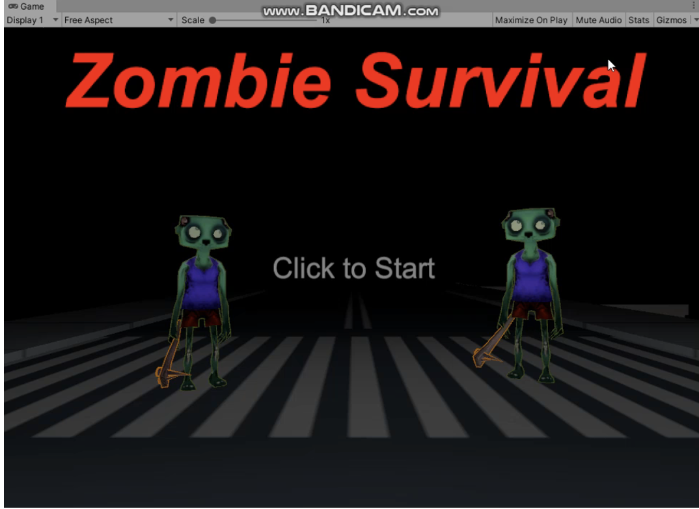
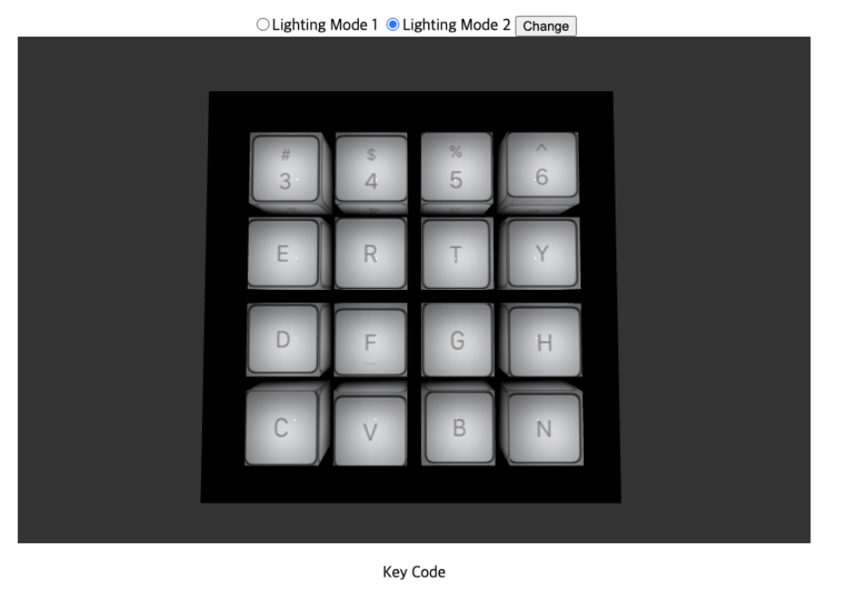
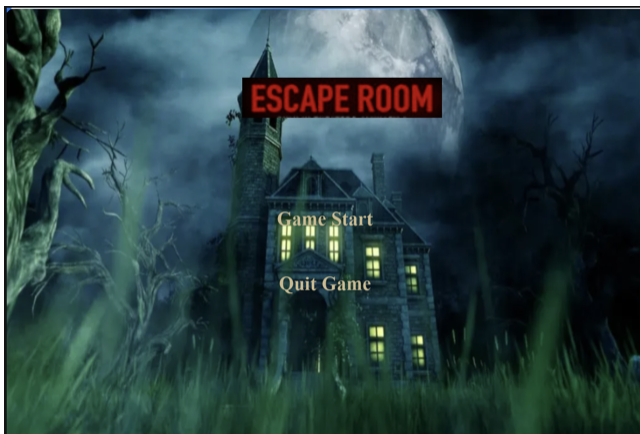
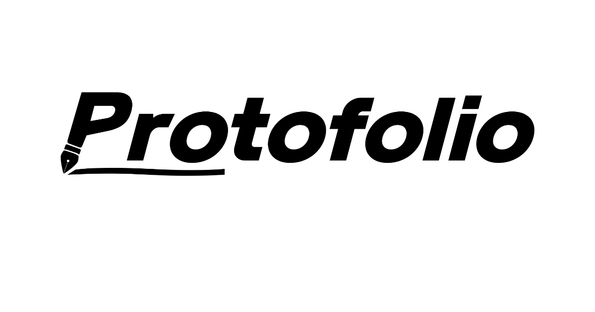
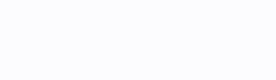

## 소개
 - 이름: 황명원
 - 군필: 11사단 병장 만기전역
 - 취미: 운동,노래듣기
 - email: auddnjs0815@gmail.com
 
```
항상 주어진 일에 최선을 다하는 것입니다.
```

## 학력
- 한림대학교 (주)콘텐츠it전공 , (복)빅데이터전공 (2018~현재)
- 육군 11사단 (2019~2020)
- 부명고등학교 (2015~2017)
<br>

## 수상이력
- 2023년 1학기 SW캡스톤디자인 우수상🥈
<br>

## 대학교 재학중 했던 활동
- 코멘토 직무프로그램(IT 8개 직무 기초체험으로 나에게 맞는 적성 찾고 기술역량 키우기) (5주간 진행)
- 코멘토 직무프로그램(데이터 엔지니어의 모든 실무 유형과 취업전략) (5주간 진행)

## 방학때 공부 했던 것
- django로 웹사이트 만들기 https://github.com/hwangmyeongwon/do_it_django
- swift로 app 만들기 https://github.com/hwangmyeongwon/do_it_iosApp

## 2018 수강 과목 (전공&복수전공)
|번호|과목명|학점|
|:---:|:---:|:---:|
|1|기초프로그래밍|B+|
|2|컴퓨팅사고와 문제해결(파이썬)|**A+**|
|3|자바 프로그래밍1|**A0**|
|4|임베디드시스템|B+|
|5|C프로그래밍|B+|

## 2021 수강 과목 (전공&복수전공)
파란글씨를 클릭할 시 해왔던 과제들을 볼 수 있습니다.

|번호|과목명|학점|
|:---:|:---:|:---:|
|1|[c++ 프로그래밍](https://github.com/hwangmyeongwon/Cpp_assignment)|B+|
|2|[파이썬 과학프로그래밍 기초](https://github.com/hwangmyeongwon/PythonBasic_assignment)|B+|
|3|[자바 프로그래밍2](https://github.com/hwangmyeongwon/java2_assignment)|**A0**|
|4|[자료구조](https://github.com/hwangmyeongwon/DataStructure_assignment)|B+|
|5|논리설계및 실험|B+|
|6|소프트웨어 개론|B0|
|7|[알고리즘](https://github.com/hwangmyeongwon/algorithm_assignment)|B+|
|8|VR/AR/게임제작기초|B+|
|9|[컴퓨터구조](https://github.com/hwangmyeongwon/ComputerArchitecture_assignment)|B+|
|10|선형대수|**A0**|
|11|[인공지능 수학](https://github.com/hwangmyeongwon/AI_Math_assignment)|B0|
|12|데이터베이스 기초|B0|


## 2022 수강 과목 (전공&복수전공)
파란글씨를 클릭할 시 해왔던 과제들을 볼 수 있습니다.

|번호|과목명|학점|
|:---:|:---:|:---:|
|1|[웹프로그래밍](https://github.com/hwangmyeongwon/WebProgramming_assignment)|**A0**|
|2|[인공지능](https://github.com/hwangmyeongwon/AI_assignment)|**A0**|
|3|[컴퓨터 그래픽스](https://github.com/hwangmyeongwon/ComputerGrapics_assignment)|**A+**|
|4|[운영체제](https://github.com/hwangmyeongwon/OperatingSystem_assignment)|**A+**|
|5|[윈도우 프로그래밍](https://github.com/hwangmyeongwon/WindowProgramming_assignment)|**A+**|
|6|[데이터베이스 시스템](https://github.com/hwangmyeongwon/DatabaseSystem_assignment)|**A+**|
|7|[게임 프로그래밍](https://github.com/hwangmyeongwon/UnrealEngine_assignment)|**A+**|
|8|[오픈소스SW개발도구 활용](https://github.com/hwangmyeongwon/UseOfOpenSourceDevelopmentTools_assignment)|B+|

## 2023 수강 과목 (전공&복수전공)
파란글씨를 클릭할 시 해왔던 과제들을 볼 수 있습니다.

|번호|과목명|
|:---:|:---:|
|1|[컴퓨터 네트워크](https://github.com/hwangmyeongwon/ComputerNetwork_assignment)|
|2|이산구조론|
|3|[데이터 사이언스 기초](https://github.com/hwangmyeongwon/Rprogramming_assignment)|
|4|[캡스톤 디자인](https://github.com/hwangmyeongwon/2023_Capstone)|

## 사용해본 기술

### Game


### language


<br>


### backend


### database


### embedded system


### server


## 프로젝트 이력

### 임베디드 시스템


- 소개:보일러를 모방하여 회로와 자바를 이용해 만든 프로젝트
- 내용:불이 들어오는 만큼 보일러는 틀었다는 것을 표현하고 보일러가 너무 높을경우 불을 깜박이며 화재 위험이 있다는 것을 알려줍니다.
- 기말 프로젝트 발표
- 사용 기술 : 자바,라즈베리파이
<br>

### 유니티


- 소개:좀비를 무찌르고 끝까지 살아남는 게임
- 내용:에셋스토어에서 무료에셋과 c#을 이용해 만든 프로젝트입니다.
- 사용 기술 : 유니티,c#
- 기말 프로젝트 발표
- 시연 영상 : https://youtu.be/4n2iUKYhDnQ

<br>

### 컴퓨터 그래픽스


- 소개:웹 페이지에 런치패드를 3d물체로 만들기
- 내용:런치패드를 컴퓨터 안에서 사용해 볼수 있다는 생각으로 만들어본 프로젝트입니다.
- 기말 프로젝트 발표
- 사용 기술 : html,css,js,webGL
- 인기투표 1등
- (자세한 내용) https://github.com/hwangmyeongwon/computer_grapic_project

<br>

### 게임 프로그래밍


- 소개: 무서운 이벤트를 보면서 해결책을 찾고 방을 탈출하는 게임
- 내용: 다양한 무서운 이벤트를 보고 엔딩까지 가기 위해 다음 문을 열 오브젝트 들을 찾는 게임 입니다.
- 기말 프로젝트 발표
- 사용 기술 : 언리얼엔진,c++
- 인기투표 3등
- (자세한 내용) https://github.com/hwangmyeongwon/unreal_engine_project

<br>

### 오픈소스


- 소개: 많은 사람들이 본인만의 포트폴리오 사이트를 가지게 하는 사이트입니다.
- 최명근 학생과 공동으로 제작
- 사용 기술 : html,css,js,Bootstrap,Semantic UI
- (자세한 내용) https://github.com/hwangmyeongwon/protofolio

<br>

### 캡스톤 디자인 (AInterview)


- 캡스톤 프로젝트 (이다해,이승연,임수빈과 공동 제작)
- 2023년 1학기 SW캡스톤디자인 우수상🥈
- 소개: 가상면접관과 면접을 보고 AI 분석으로 제공해주는 피드백으로 집에서도 면접연습을 할 수 있도록 도와주는 웹사이트
- 내용: 프론트엔드 역할을 맡았으며 인공지능 기술을 웹사이트 위에 올릴수 있도록 디자인 구상
- 사용 기술 : html,css,js,Bootstrap
- (자세한 내용) https://github.com/hwangmyeongwon/2023_Capstone
